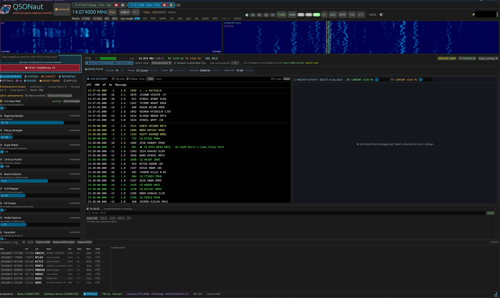
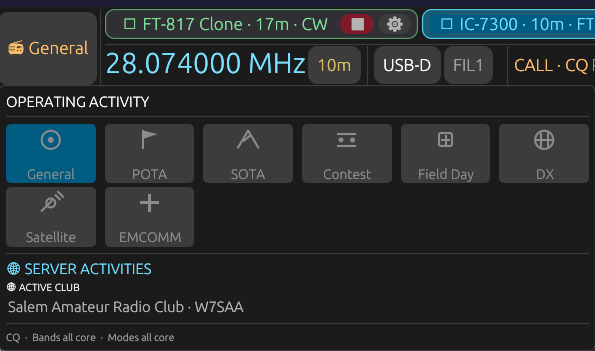
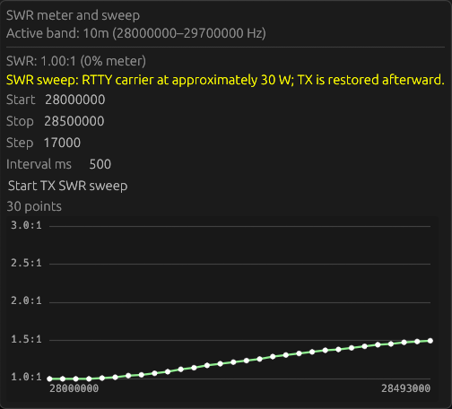

<p align="center">
  
</p>

# QSONaut

[](https://github.com/nicksbar/QSONaut/actions/workflows/ci.yml)
[](https://github.com/nicksbar/QSONaut/actions/workflows/release-builds.yml)
[](https://github.com/nicksbar/QSONaut/releases)

**An enthusiast-built amateur-radio mission control console.**

QSONaut combines radio control, live audio and spectrum views, WSJT-family
digital modes, contact logging, and early operator-assist scaffolding in one native
Rust desktop app.

> [!IMPORTANT]
> QSONaut is alpha software and is still evolving. Hardware support and
> on-air behavior vary by radio, platform, and mode; IC-7300 control is the
> current hardware-validated path. Review frequency, power, audio, band plan,
> and transmit state yourself. QSONaut is not an unattended-operation system
> or a safety interlock.

<p align="center">
  
  <br>
  <em>QSONaut radio console on Linux/WSL. The station identity in the overview banner is redacted.</em>
</p>

<p align="center">
  
  
</p>

<p align="center">
  <em>Operating activities and the live SWR meter/sweep workflow.</em>
</p>

## Capabilities

The current application brings the station workflow into one native Rust desktop
console. This is an honest capability snapshot, not a compatibility promise:

| Area | Current maturity |
| --- | --- |
| Digital modes | FT8 and FT4 provide native decode, activity, conversation, TX history, sequencing, logging, and explicit global TX disarm. FST4-60, JT9, JT65, and Q65-30A have experimental receive/scheduled-TX paths; WSPR and MSK144 are receive-only integrations. |
| SSTV and local images | Single-channel auto-targeting finds shifted VIS headers across the audio baseband, and Auto VIS receive or manual receive filtering decodes 13 Martin/Scottie/Robot/PD modes. Waterfall clicking overrides targeting; acquisition, ranked-candidate, progress, and failure diagnostics use the filterable Application Log. The pinned adapter also provides selectable experimental TX. Existing images can be browsed or generated through local Ollama/Lemonade models, and TX remains explicitly armed. |
| CW | Software audio CW through [cw-dit](https://github.com/nicksbar/cw-dit), with selected-channel streaming decode, adaptive timing, noise-floor slicing, and generated subband TX. Paddle/keyed-carrier input, prosigns, punctuation, and auto-sequencing are not implemented yet. |
| Radio control | Rigwright profiles cover Icom CI-V, modern and classic Yaesu CAT, and Kenwood PC control, with generic and model-specific profiles. Capability-gated power, AF/RF gain, squelch, RF power, preamp/attenuator, NB, NR, IP+, notch, AGC, tuner, normalized meters, and SWR controls are exposed where supported. IC-7300 is hardware-validated; other serial drivers remain experimental. |
| Spectrum and audio | Equal-height radio/audio waterfalls, narrow/active-band views, VBW controls, click-to-tune audio/radio scopes, upper-banner scope details, audio-device selection, decoder-channel monitoring, and RX monitor volume. Radio scope and vendor controls remain capability-gated. |
| SWR and tuner | Normalized live SWR display plus an experimental stepped active-band sweep with configurable range/step/interval, low-power carrier pipeline, tuner safety, stop/disarm handling, charting, and application-log diagnostics. |
| Station workflow | Contact log with ADIF import/export, operator profiles, QSO history, PSK Reporter (optional and off by default), and a live in-app application log with filtering, highlighting, copy, and bottom-follow. |
| QSONaut Server | Optional WSS event/catalog sync, station presence, radio metadata, idempotent QSO publication, shared channels, and manual diagnostics. Each outbound data category is independently opt-in. |
| Automation and compute | Permission-gated automation foundations and compute-backend detection exist; Discord/IRC connectors and GPU/NPU decoder kernels are not validated yet. |

See the detailed [QSONaut feature matrix](docs/feature-matrix.md) for the
implementation-level status of radio controls, normalized meters, SWR/tuner
workflows, digital modes, SSTV, station tools, server integration, automation,
and deliberate gaps.

For the settings split between application-wide station state, independent
radio tabs, and shared radio-tuning definitions, see
[Settings ownership](docs/settings-ownership.md).

The primary development environment is Linux/WSL with USB audio and Icom CI-V.
Windows and ARM build jobs exist, but a green build is not the same as hardware
validation.

QSONaut is developed with AI-assisted tooling alongside human review, tests,
and hardware validation. That development history is part of the project, but
the practical maturity boundary is the alpha status and the hardware-specific
validation above.

## Build and run

QSONaut uses the upstream
[`mfsk-core`](https://github.com/jl1nie/mfsk-core) Git dependency. No local
`mfsk-core` checkout is required:

```bash
git clone https://github.com/nicksbar/QSONaut.git
cd QSONaut
cargo run --release -p qsonaut -- --gui
```

Cargo resolves a pinned upstream revision and records that source in
`Cargo.lock` for reproducible builds.

Use a release build for live decoding. Debug builds are substantially slower.

On Ubuntu, native build dependencies include:

```bash
sudo apt-get install libasound2-dev libudev-dev libwayland-dev libxkbcommon-dev
```

WSL also needs the ALSA PulseAudio bridge so CPAL can reach WSLg audio:

```bash
sudo apt-get install libasound2-plugins pulseaudio-utils
```

See [Audio monitoring](docs/audio-monitoring.md) for native OS setup, WSL
verification, device selection, and troubleshooting.

On WSLg systems with `/dev/dxg`, QSONaut supplies the Mesa D3D12 and WGPU GL
defaults automatically while preserving explicit environment overrides. To
force a particular Windows GPU through Mesa, use:

```bash
GALLIUM_DRIVER=d3d12 \
MESA_D3D12_DEFAULT_ADAPTER_NAME=AMD \
cargo run --release -p qsonaut -- --gui
```

The active rendering adapter and session-only power/GPU preferences are shown
under **Settings > Graphics**. The default is **Low power / Auto**. Applying a
change restarts only the GUI process; it does not write the choice to an
operator profile.

QSONaut also offers hardware discovery and lower-level radio commands. Audio
devices are refreshed and selected in **Settings > Devices**:

```bash
cargo run -p qsonaut -- --help
cargo run -p qsonaut -- --list-radio
```

## QSONaut Server Integration

QSONaut Server is the independent coordination service for QSONaut operators,
clubs, and group events. QSONaut can optionally use it for event/catalog
synchronization, station presence, selected radio metadata, idempotent QSO
publication, shared channels, and manually requested diagnostics.

Server connectivity and each sharing category are independently opt-in. The
server project owns deployment, accounts, enrollment, device tokens, and its
management UI; this repository documents only the QSONaut client boundary.
See [QSONaut-Server](https://github.com/nicksbar/QSONaut-Server) for server
setup and [`docs/server-integration.md`](docs/server-integration.md) for
client-side configuration and privacy behavior.

## Configuration and privacy

Copy `.env.example` for optional environment overrides or pass
`--config qsonaut.toml.example`. Local `.env`, operator profile, QSO log, and
recorded WAV files are ignored by Git.

The SSTV workspace can use an Ollama or Lemonade Server image model running on
the same computer. This integration is local-only by construction: QSONaut
accepts only `http://localhost`, `127.0.0.0/8`, or IPv6 loopback endpoints and
disables proxy discovery for these requests. No prompt, station detail, or
generated image is sent to QSONaut Server. See
[`docs/sstv-local-images.md`](docs/sstv-local-images.md).

Runtime logs are written to `qsonaut.log` under the platform app directory:

- Windows: `%APPDATA%\QSONaut\logs\qsonaut.log`
- Linux: `$XDG_CONFIG_HOME/qsonaut/logs/qsonaut.log` (or `~/.config/qsonaut/logs/qsonaut.log`)
- macOS: `~/Library/Application Support/QSONaut/logs/qsonaut.log`

The newest 256 KiB can also be viewed from the in-app **APP LOG** tab with live
tailing, bottom-follow, text/level filters, highlighting, and copy support.
Manual server diagnostic snapshots can optionally include a separately enabled,
redacted 24 KiB tail; logs are never uploaded continuously.

If QSONaut fails to open a window or crashes during startup, attach that log
file to the issue report.

QSONaut renders through eframe's `wgpu` backend on every platform. The selected
renderer is recorded in `qsonaut.log`.

UI scale now uses a rebased baseline: the physical size that previously looked
like 75% is now the 100% preset.

QSONaut respects the OS-provided DPI scale. Windows presets use the physical
baseline that previously appeared as 75% on this desktop, so that baseline is
labelled 100% on Windows; Linux keeps the existing preset labels. For other
platform-specific display quirks, the final application zoom can be tuned with
a multiplier from `0.75` to `1.50` (default `1.0`): `QSONAUT_WINDOWS_DPI_ADJUSTMENT`,
`QSONAUT_LINUX_DPI_ADJUSTMENT`, or `QSONAUT_MACOS_DPI_ADJUSTMENT`. Startup logs
record the selected OS, adjustment, raw DPI, application zoom, and effective
scale. All platforms provide the shared `50, 60, 75, 85, 100, 110, 125, 150,
175%` scale choices.

Reception data stays local unless you explicitly enable PSK Reporter. External
automation source declarations reference environment-variable names rather
than embedding Discord or IRC credentials.

QSONaut Server connectivity and each sharing category are also disabled by
default. See [`docs/server-integration.md`](docs/server-integration.md) for
device enrollment and proxy-friendly WSS configuration.

## Repository map

- `apps/qsonaut` — CLI and desktop entry point
- `crates/qsonaut-gui` — operator console and timed mode workflows
- [`rigwright`](https://github.com/nicksbar/rigwright) — sibling radio HAL and native Icom CI-V implementation

QSONaut resolves the published `rigwright` crate from crates.io, and
`Cargo.lock` pins the exact release for reproducible CI and release builds.
For local development against the paired sibling checkout, copy
`.cargo/config.toml.example` to `.cargo/config.toml`; the ignored local file
overrides the published dependency with `../rigwright` without changing
committed manifests. CI does not use this override and does not need a
Rigwright checkout.
- `crates/qsonaut-audio` — real-time audio and high-quality 48→12 kHz decimation
- `crates/qsonaut-sstv` — streaming VIS/AFC adapter plus pinned multi-mode SSTV codecs
- `mfsk-core` — WSJT-family modem encoding and decoding
- [`cw-dit`](https://github.com/nicksbar/cw-dit) — reusable Rust CW DSP and streaming Morse components (`cwdit-dsp`, `cwdit-morse`), MIT OR Apache-2.0
- `crates/qsonaut-log`, `qsonaut-pskreporter` — local logging and opt-in reporting
- `crates/qsonaut-server-client` — optional authenticated WSS synchronization
- `crates/qsonaut-accelerate` — measured compute-backend selection
- `crates/qsonaut-automation` — sandboxed component and external-source foundation
- `docs` — current implementation notes; historical scratch research was intentionally removed before publication

## Versioning and release process

QSONaut uses SemVer tags (`vMAJOR.MINOR.PATCH`) and a curated
[`CHANGELOG.md`](CHANGELOG.md). Release assets and release notes are generated
from those tags and changelog entries.

See [`docs/versioning-and-releases.md`](docs/versioning-and-releases.md) for
the concrete policy and release checklist.

## Before transmitting

At minimum:

1. Confirm the selected audio input/output and CI-V serial device.
2. Verify dial frequency, mode, filter, data mode, RF power, and TX audio level.
3. Start into a dummy load or minimum safe power where practical.
4. Keep the global **STOP + DISARM ALL TX** control visible and tested.

You are responsible for lawful operation and for every transmission made with
this software.

## Contributing

Bug reports with platform, radio, audio device, logs, and exact reproduction
steps are especially useful. Tests and captured protocol fixtures are preferred
over claims of compatibility. Please do not commit credentials, personal QSO
logs, recordings, or proprietary manuals.

### About credits

The About panel credits the original author, plus optional contributors and
testers. Release builds read the comma-separated repository Actions variables
`QSONAUT_CONTRIBUTORS` and `QSONAUT_TESTERS`; unset or empty variables display
`None listed`. Set them under the repository's **Settings → Secrets and
variables → Actions → Variables** page so credit names or callsigns can be
updated without changing source code.

## Acknowledgements

QSONaut's WSJT-family decode and synthesis engine is powered by
**[`mfsk-core`](https://github.com/jl1nie/mfsk-core)**, developed and maintained
by the [`mfsk-core` contributors](https://github.com/jl1nie/mfsk-core/graphs/contributors).
It provides the protocol, DSP, message-codec, and waveform machinery behind
QSONaut's FT8, FT4, FST4, WSPR, JT9, JT65, Q65, and MSK144 integrations.

We are grateful to that project for making a serious pure-Rust WSJT-family
engine available to the amateur-radio community. `mfsk-core` is licensed
**GPL-3.0-or-later** and carries its own attribution to WSJT-X, Joe Taylor
K1JT, and collaborators. See [`THIRD_PARTY_NOTICES.md`](THIRD_PARTY_NOTICES.md)
for the exact source revision and license details used by QSONaut releases.

## License

QSONaut's original source code is offered under the MIT license; see
[`LICENSE`](LICENSE). QSONaut currently links with GPL-3.0-or-later
`mfsk-core`, so distributed combined binaries are also subject to the
applicable GPL terms. See [`THIRD_PARTY_NOTICES.md`](THIRD_PARTY_NOTICES.md).
