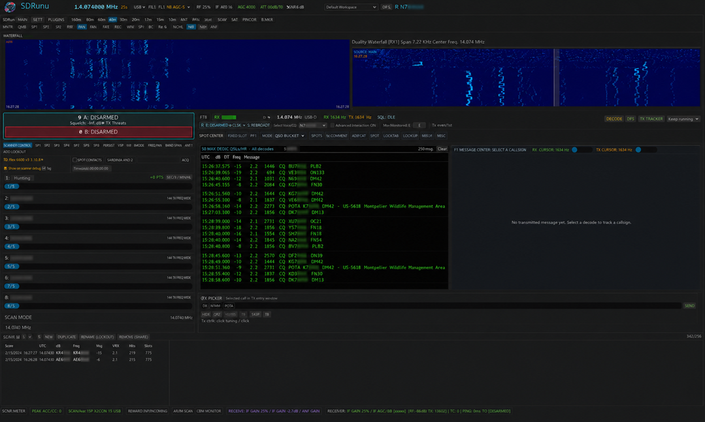

<p align="center">
  
</p>

# QSONaut

[](https://github.com/nicksbar/QSONaut/actions/workflows/ci.yml)
[](https://github.com/nicksbar/QSONaut/actions/workflows/release-builds.yml)
[](https://github.com/nicksbar/QSONaut/releases)

**A very early, enthusiast-built amateur-radio mission control experiment.**

QSONaut combines radio control, live audio and spectrum views, WSJT-family
digital modes, contact logging, and early operator-assist scaffolding in one native
Rust desktop app.

> [!CAUTION]
> QSONaut is pre-alpha, vibe coded, and changing quickly. Much of it was built
> through iterative human/AI collaboration. It has not had broad radio,
> platform, or on-air validation. Review your radio settings, power, audio,
> frequency, band plan, and transmit state yourself. Do not trust it for
> unattended operation or as a safety interlock.

<p align="center">
  
  <br>
  <em>Early FT8 flight deck on Linux/WSL. Operator identity is intentionally blurred.</em>
</p>

There is currently no end-user LLM feature to enable. The `qsonaut-ai` crate
and related config knobs are placeholder scaffolding for future experiments,
and they are not in QSONaut's active receive/transmit control path.

## What works today

This is an honest snapshot, not a compatibility promise:

| Area | Current maturity |
| --- | --- |
| FT8 | Native RX/TX workflow, sequencing, highlighted callsign hits, logging, and explicit global TX disarm; still needs broader on-air testing |
| FT4 | Native RX/TX workflow using the same safety model; younger and less exercised than FT8 |
| FST4-60, JT9, JT65, Q65-30A | Native receive and scheduled transmit paths exist; experimental |
| WSPR, MSK144 | Receive-only integration |
| CW, FLDIGI | UI/integration surfaces only; no native working modem is claimed |
| Radio control | Selectable Rigwright profiles cover popular Icom, Yaesu (including FTdx101 and FT-857D), and Kenwood radios; IC-7300 is hardware-validated, while the other serial drivers remain experimental |
| PSK Reporter | Optional, off by default, batched UDP reporting for decoded stations |
| Automation | Permission-gated component model and Discord/IRC configuration contracts; connectors are not live yet |
| GPU/NPU compute | Hardware detection and validation policy exist; decoders currently use CPU SIMD because GPU kernels are not validated |

The primary development environment is Linux/WSL with USB audio and Icom CI-V.
Windows and ARM build jobs exist, but a green build is not the same as hardware
validation.

## Build and run

QSONaut currently uses
[`mfsk-core`](https://github.com/jl1nie/mfsk-core) as a sibling source checkout:

```bash
git clone https://github.com/nicksbar/QSONaut.git
git clone https://github.com/jl1nie/mfsk-core.git
cd QSONaut
cargo run --release -p qsonaut -- --gui
```

By default, QSONaut tracks `mfsk-core` `main` during active integration.

Use a release build for live decoding. Debug builds are substantially slower.

On Ubuntu/WSL, native build dependencies include:

```bash
sudo apt-get install libasound2-dev libudev-dev libwayland-dev libxkbcommon-dev
```

For WSL systems where Mesa otherwise selects software rendering, this is the
known-good launch pattern used during development:

```bash
GALLIUM_DRIVER=d3d12 \
MESA_D3D12_DEFAULT_ADAPTER_NAME=AMD \
cargo run --release -p qsonaut -- --gui
```

QSONaut also offers hardware discovery and lower-level CI-V commands:

```bash
cargo run -p qsonaut -- --help
cargo run -p qsonaut -- --list-audio
cargo run -p qsonaut -- --list-radio
```

## Configuration and privacy

Copy `.env.example` for optional environment overrides or pass
`--config qsonaut.toml.example`. Local `.env`, operator profile, QSO log, and
recorded WAV files are ignored by Git.

AI-related environment keys are currently inert placeholders and can be left at
their defaults.

Runtime logs are written to `qsonaut.log` under the platform app directory:

- Windows: `%APPDATA%\QSONaut\logs\qsonaut.log`
- Linux: `$XDG_CONFIG_HOME/qsonaut/logs/qsonaut.log` (or `~/.config/qsonaut/logs/qsonaut.log`)
- macOS: `~/Library/Application Support/QSONaut/logs/qsonaut.log`

If QSONaut fails to open a window or crashes during startup, attach that log
file to the issue report.

For renderer troubleshooting, QSONaut also honors `QSONAUT_RENDERER`:

- `QSONAUT_RENDERER=wgpu`
- `QSONAUT_RENDERER=glow`

The selected renderer is recorded in `qsonaut.log`.

UI scale now uses a rebased baseline: the physical size that previously looked
like 75% is now the 100% preset.

Reception data stays local unless you explicitly enable PSK Reporter. External
automation source declarations reference environment-variable names rather
than embedding Discord or IRC credentials.

## Repository map

- `apps/qsonaut` — CLI and desktop entry point
- `crates/qsonaut-gui` — operator console and timed mode workflows
- [`rigwright`](https://github.com/nicksbar/rigwright) — sibling radio HAL and native Icom CI-V implementation

QSONaut normally resolves `rigwright` from its GitHub repository. `Cargo.lock`
pins the exact source revision for reproducible builds. For
local development against a sibling checkout, copy `.cargo/config.toml.example`
to `.cargo/config.toml`; the local file is ignored by Git and overrides the
Git dependency with `../rigwright` without changing committed manifests. Run
`cargo update -p rigwright` when you intentionally want the latest GitHub head.
- `crates/qsonaut-audio`, `qsonaut-dsp`, `qsonaut-modes` — real-time media and modem support
- `crates/qsonaut-log`, `qsonaut-pskreporter` — local logging and opt-in reporting
- `crates/qsonaut-accelerate` — measured compute-backend selection
- `crates/qsonaut-automation` — sandboxed component and external-source foundation
- `docs` — current implementation notes; historical scratch research was intentionally removed before publication

## Versioning and release process

QSONaut uses SemVer tags (`vMAJOR.MINOR.PATCH`) and a curated
[`CHANGELOG.md`](CHANGELOG.md). Release assets and release notes are generated
from those tags and changelog entries.

See [`docs/versioning-and-releases.md`](docs/versioning-and-releases.md) for
the concrete policy and release checklist.

## Before transmitting

At minimum:

1. Confirm the selected audio input/output and CI-V serial device.
2. Verify dial frequency, mode, filter, data mode, RF power, and TX audio level.
3. Start into a dummy load or minimum safe power where practical.
4. Confirm **TX SAFE** really means PTT is released on your own hardware.
5. Keep the global **STOP + DISARM ALL TX** control visible and tested.

You are responsible for lawful operation and for every transmission made with
this software.

## Contributing

Bug reports with platform, radio, audio device, logs, and exact reproduction
steps are especially useful. Tests and captured protocol fixtures are preferred
over claims of compatibility. Please do not commit credentials, personal QSO
logs, recordings, or proprietary manuals.

## Acknowledgements

QSONaut's WSJT-family decode and synthesis engine is powered by
**[`mfsk-core`](https://github.com/jl1nie/mfsk-core)**, developed and maintained
by the [`mfsk-core` contributors](https://github.com/jl1nie/mfsk-core/graphs/contributors).
It provides the protocol, DSP, message-codec, and waveform machinery behind
QSONaut's FT8, FT4, FST4, WSPR, JT9, JT65, Q65, and MSK144 integrations.

We are grateful to that project for making a serious pure-Rust WSJT-family
engine available to the amateur-radio community. `mfsk-core` is licensed
**GPL-3.0-or-later** and carries its own attribution to WSJT-X, Joe Taylor
K1JT, and collaborators. See [`THIRD_PARTY_NOTICES.md`](THIRD_PARTY_NOTICES.md)
for the exact source revision and license details used by QSONaut releases.

## License

QSONaut's original source code is offered under the MIT license; see
[`LICENSE`](LICENSE). QSONaut currently links with GPL-3.0-or-later
`mfsk-core`, so distributed combined binaries are also subject to the
applicable GPL terms. See [`THIRD_PARTY_NOTICES.md`](THIRD_PARTY_NOTICES.md).
