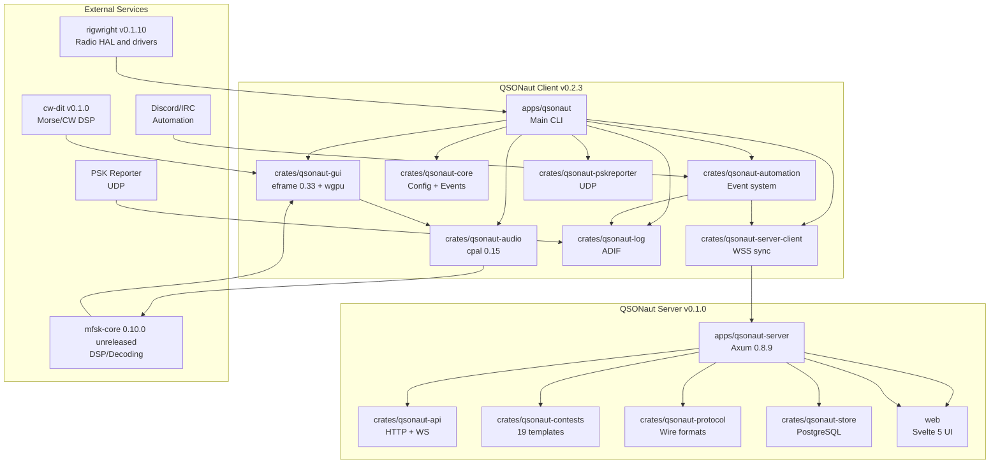
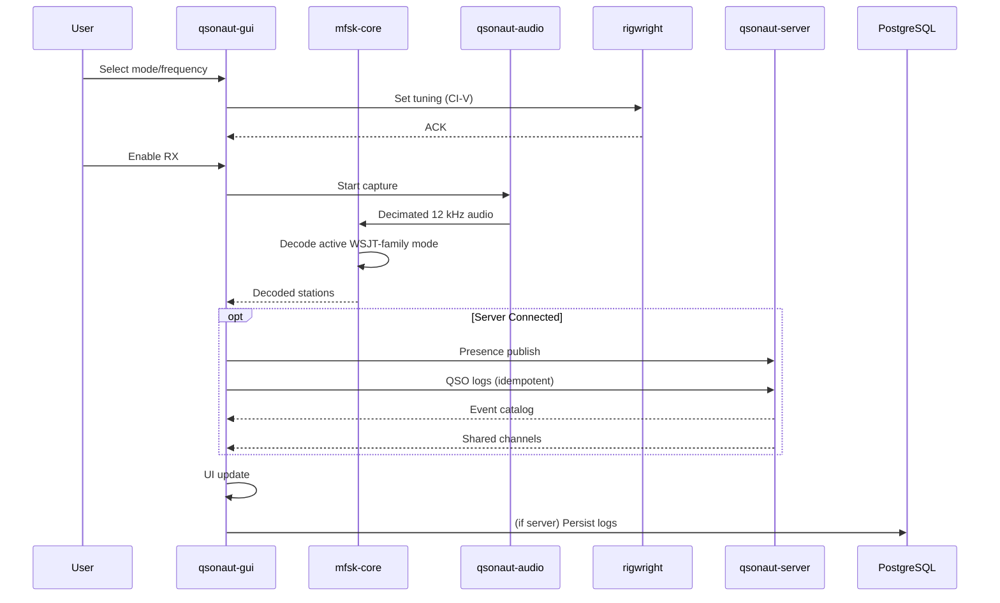
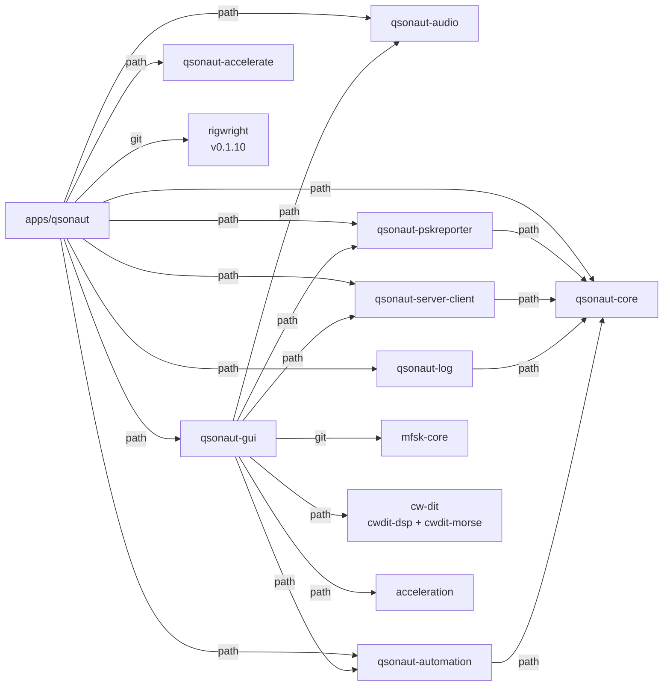
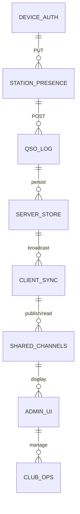
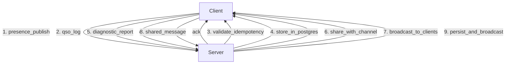
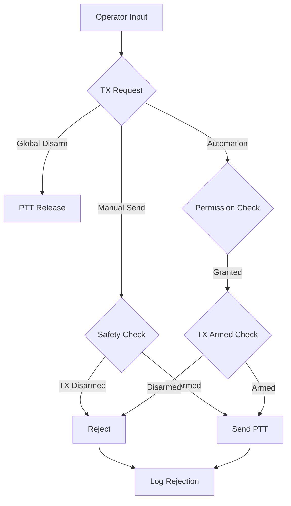

# QSONaut Architecture Diagram

## High-Level Architecture

### Data Flow

---

## Component Dependencies

### QSONaut Client Dependency Graph

---

## Server API Contract

### WebSocket Messages (qsonaut.v1)

---

## Safety Model

---

## Version Relationships

| Component | Version | Notes |
|-----------|---------|-------|
| QSONaut Client | 0.2.3 | Main feature branch |
| QSONaut Server | 0.1.0 | Independent release |
| mfsk-core | 0.10.0 (unreleased) | Git dependency; pinned upstream commit |
| rigwright | 0.1.10 | crates.io |
| eframe | 0.33 | GUI framework |
| tokio | 1.0 | Async runtime |
| sqlx | 0.8.6 | Server DB |

---

## Recent Changes Summary

### QSONaut v0.2.3 (2026-08-14)
- ✅ Server integration (v0.1.0)
- ✅ Multi-radio selection
- ✅ CI-V scope controls
- ✅ Automation events
- ✅ Persistent UI state

### mfsk-core 0.10.0 (unreleased upstream)
- ✅ FT8 WSJT-X parity
- ✅ WSPR full integration
- ✅ Q65 precision fixes
- ✅ Better test coverage

### QSONaut Server v0.1.0
- ✅ Authenticated WebSocket
- ✅ Contest catalog (19 templates)
- ✅ Club operations
- ✅ Station tokens
