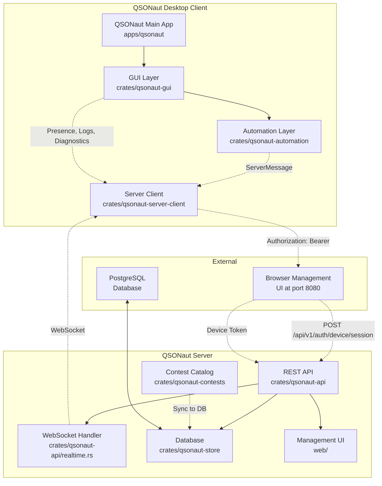
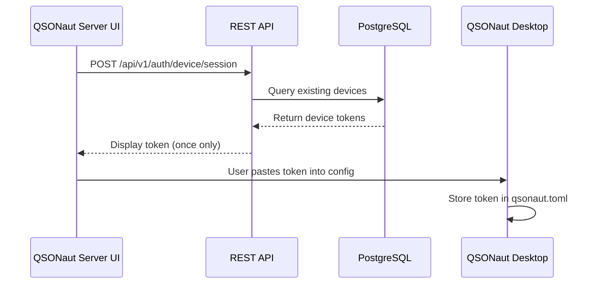
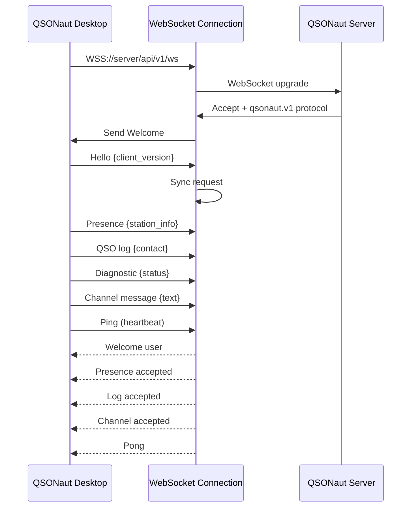
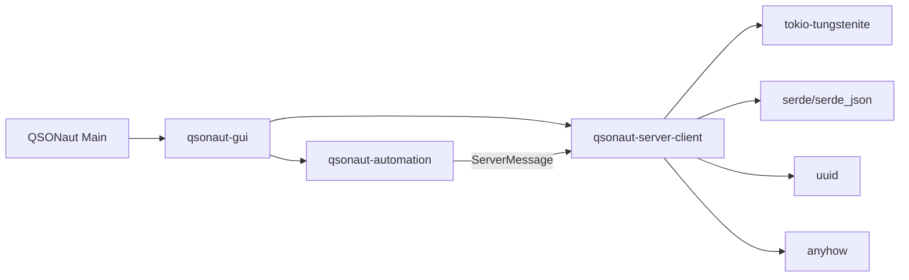
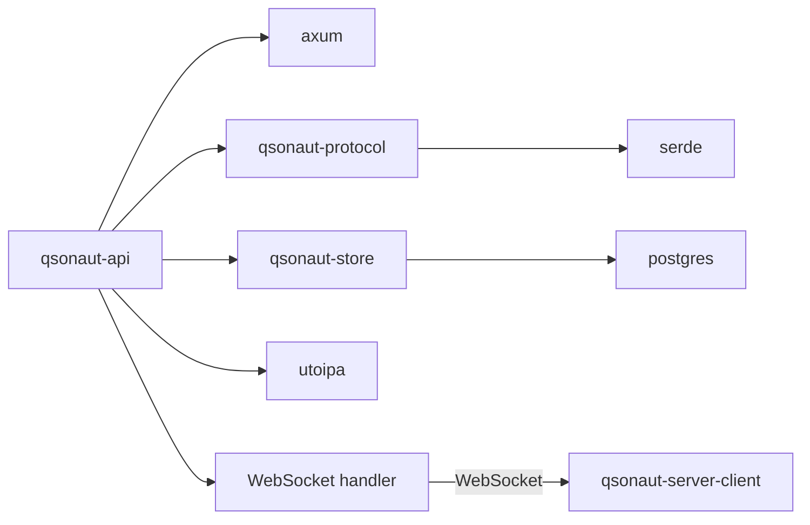
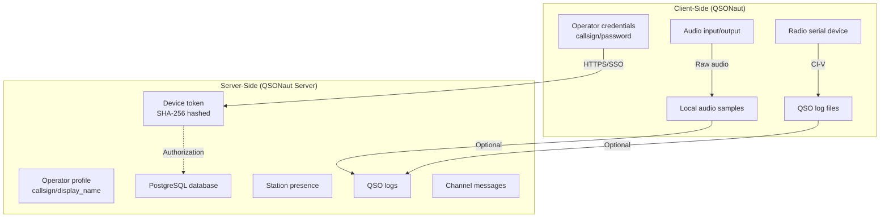

# QSONaut Server Integration - Dependencies Map

## Overview Diagram



## Data Flow Diagrams

### 1. Device Token Flow



### 2. WebSocket Connection Flow



### 3. Station Presence Flow

```mermaid
sequenceDiagram
    participant Client as QSONaut Desktop
    participant WS as WebSocket
    participant API as QSONaut Server
    
    Client->>WS: PUT /api/v1/stations/presence
    JSON payload:
      instance_id: uuid
      callsign: N1CALL
      radio_model: IC-7300
      frequency: 14.085 MHz
      status: online
      
    WS-->>Client: Presence accepted (acknowledgment)
```

### 4. QSO Logging Flow

```mermaid
sequenceDiagram
    participant Client as QSONaut Desktop
    participant WS as WebSocket
    participant API as QSONaut Server
    
    Client->>WS: POST /api/v1/logs
    JSON payload:
      operator_callsign: N1CALL
      callsign: N2TEST
      mode: FT8
      frequency: 14.085 MHz
      points: 126
      timestamp: ISO8601
      idempotency_key: uuid
      
    WS-->>Client: Log accepted (duplicate check)
```

### 5. Event Catalog Sync Flow

```mermaid
sequenceDiagram
    participant Client as QSONaut Desktop
    participant WS as WebSocket
    participant Server as QSONaut Server
    
    Server->>WS: Snapshot {
      events: [active_event],
      contest_templates: [...],
      channel_messages: [...]
    }
    
    WS-->>Client: Receive snapshot
    Client->>Client: Update UI with events
    Client->>Client: Update contest options
```

## API Endpoints Reference

### Authentication

| Method | Endpoint | Auth | Description |
|--------|----------|------|-------------|
| POST | `/api/v1/auth/device` | None | Register device, get bearer token |
| POST | `/api/v1/auth/device/session` | Login required | Browser session token |
| DELETE | `/api/v1/auth/device/{id}` | Device token | Revoke device token |

### Presence

| Method | Endpoint | Auth | Description |
|--------|----------|------|-------------|
| PUT | `/api/v1/stations/presence` | Device token | Publish station presence |

### QSO Logging

| Method | Endpoint | Auth | Description |
|--------|----------|------|-------------|
| POST | `/api/v1/logs` | Device token | Submit QSO log |
| GET | `/api/v1/logs` | Device token | Query logs |

### Diagnostics

| Method | Endpoint | Auth | Description |
|--------|----------|------|-------------|
| GET | `/api/v1/diagnostics` | Device token | Get diagnostic reports |
| POST | `/api/v1/diagnostics` | Device token | Send diagnostic report |

### Channels

| Method | Endpoint | Auth | Description |
|--------|----------|------|-------------|
| POST | `/api/v1/channel-messages` | Device token | Publish message |
| GET | `/api/v1/channel-messages` | Device token | List messages |

### Events

| Method | Endpoint | Auth | Description |
|--------|----------|------|-------------|
| GET | `/api/v1/events` | Device token | List events |
| POST | `/api/v1/events` | Device token | Create event |
| PATCH | `/api/v1/events/{id}/status` | Device token | Update event status |

### Contest Templates

| Method | Endpoint | Auth | Description |
|--------|----------|------|-------------|
| GET | `/api/v1/contest-templates` | None | Get all templates |

### WebSocket

| Endpoint | Protocol | Purpose |
|----------|----------|---------|
| GET `/api/v1/ws` | qsonaut.v1 | Real-time sync |

## Component Dependencies

### QSONaut Client Dependencies



### QSONaut Server Dependencies



## Version Synchronization Points

| Point | Location | Version | Notes |
|-------|----------|---------|-------|
| Cargo workspace | QSONaut/Cargo.toml | 0.2.3 | Main client version |
| Protocol version | qsonaut-protocol/src/lib.rs | v1 | API version string |
| WebSocket protocol | qsonaut-server-client/src/lib.rs | qsonaut.v1 | Subprotocol name |
| Message format | qsonaut-protocol/src/lib.rs | Structured | JSON envelope |

## Security Boundaries



## Data Retention Policy

| Data Type | Retention | Scope |
|-----------|-----------|-------|
| Device tokens | 90 days | Server |
| Station presence | Server-configured | Server |
| QSO logs | Server-configured | Server |
| Channel messages | Server-configured | Server |
| Diagnostics | Server-configured | Server |
| Contest templates | Permanent | Server |

## Future Enhancements

1. **N3FJP Integration**
   - Club roster synchronization
   - Governance operations
   - Election management

2. **Real-time Features**
   - Live event updates
   - Multi-operator sessions
   - Automated contest reporting

3. **Extended Diagnostics**
   - Hardware health checks
   - Performance metrics
   - Resource utilization
